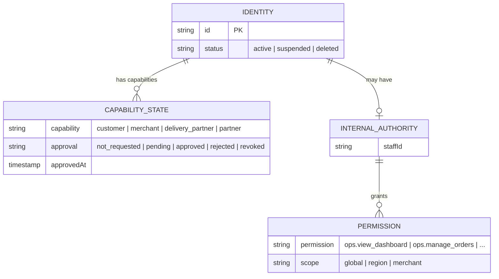
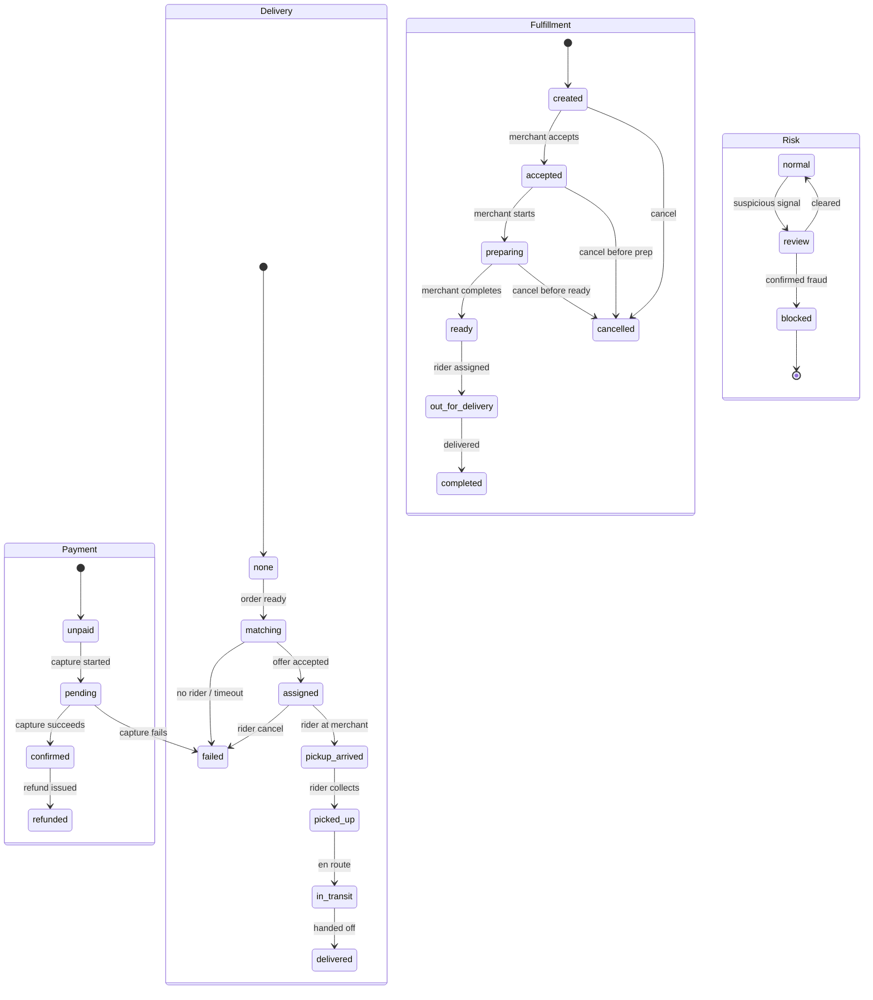
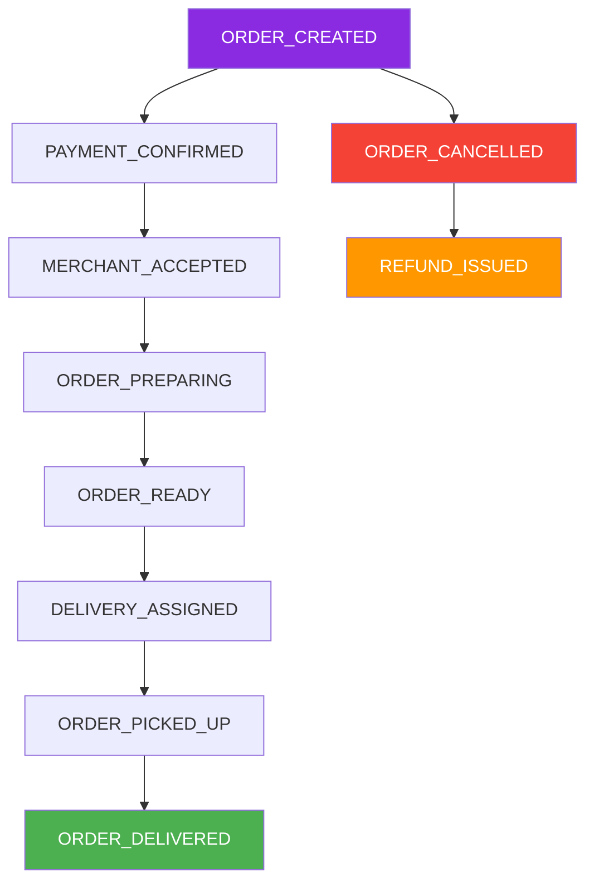
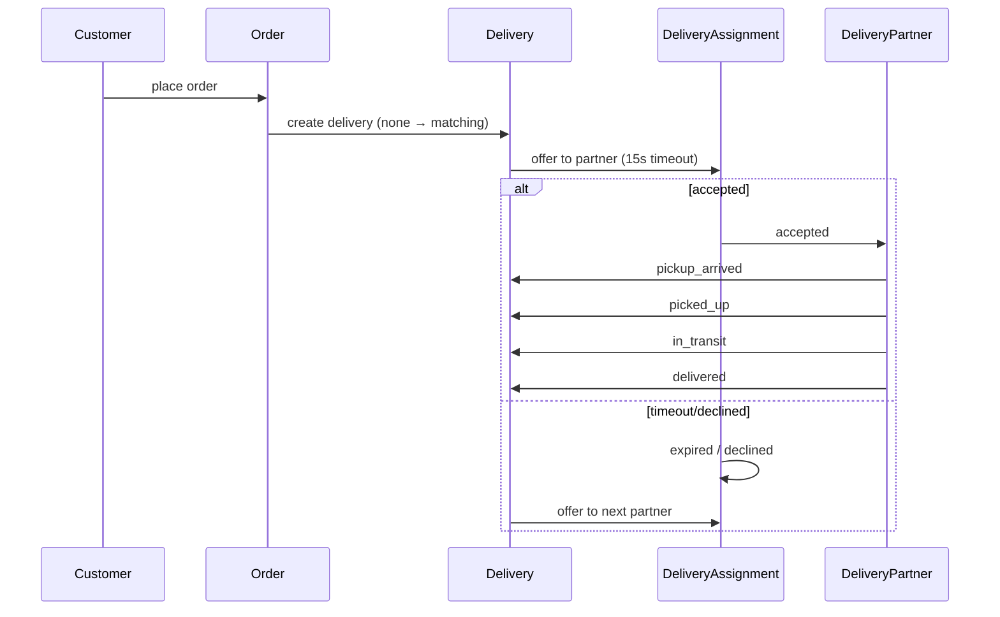
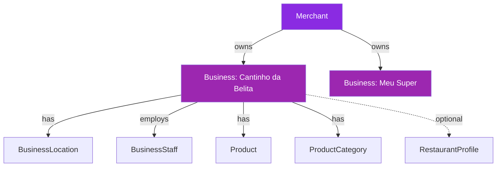
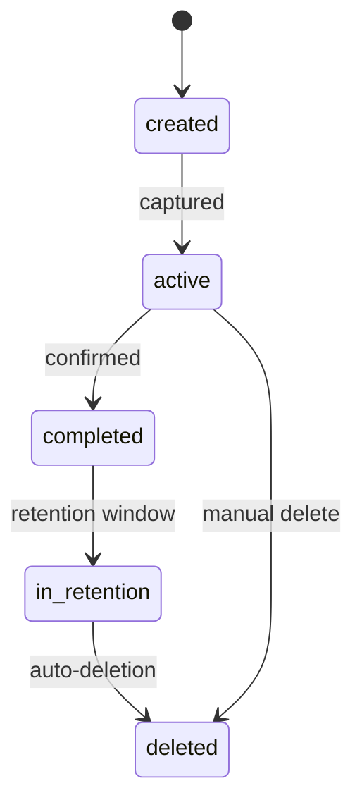
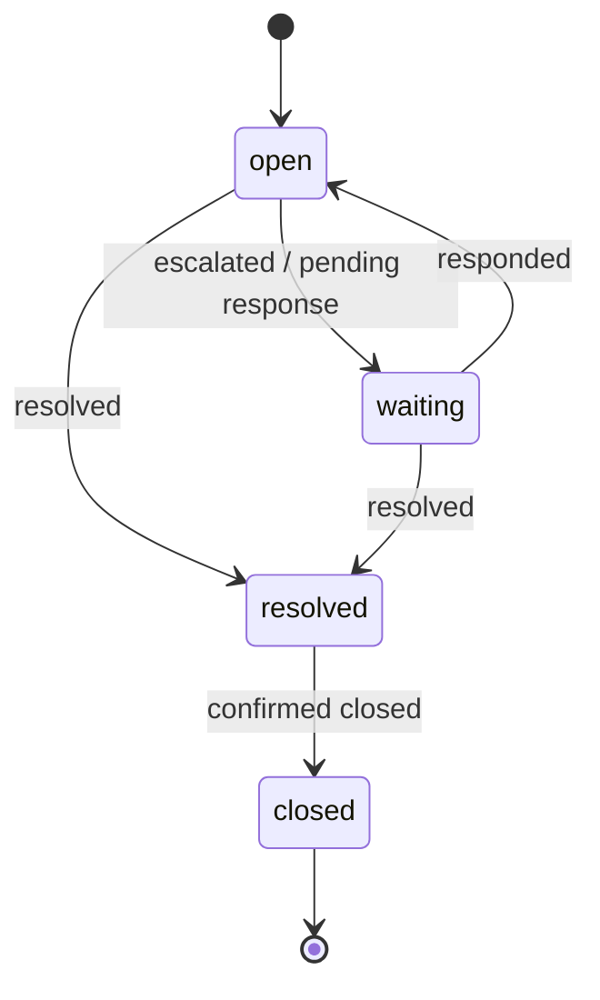
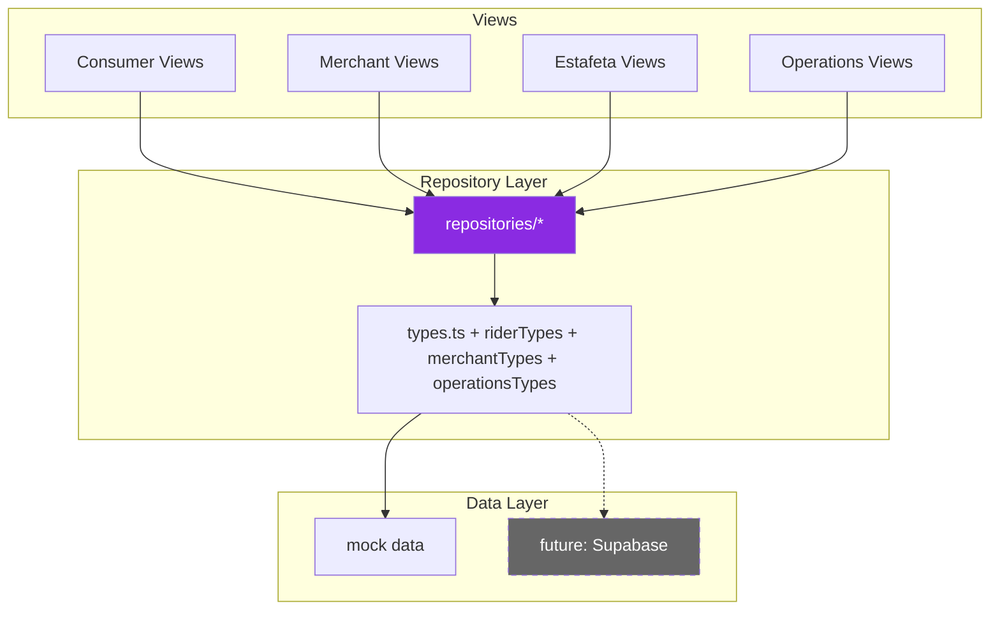

# PEDEJÁ — Domain Model & Data Boundaries

Canonical domain documentation. This document defines *what Pedejá is* at the data
level, before any persistence is introduced.

Date: 2026-09-10
Status: **draft — no Supabase connected, no database created.**

Companion docs: `PRODUCT_DECISIONS.md`, `SECURITY_ARCHITECTURE.md`, `IMPLEMENTATION_PLAN.md`.

---

## 1. Design principles

1. **Identity ≠ role.** `Identity` is the person/account. Marketplace capabilities are
   independently granted and revocable (see §2).
2. **Internal authority is a separate security layer** (Operations) and never a consumer-side flag.
3. **Money is exact.** All monetary values are `Money { amount: number; currency: 'AOA' }` with
   `amount` as an integer in Kz — never floats in persistence.
4. **Order state is multidimensional.** Payment, fulfillment, delivery and risk are separate
   dimensions; they must be able to disagree legitimately (e.g. payment confirmed + preparing +
   delivery not yet assigned).
5. **Order, Delivery and Assignment are different aggregates.**
   - `Order` = what was purchased / requested.
   - `Delivery` = what must physically move.
   - `DeliveryAssignment` = which approved partner is currently responsible.
6. **UI never reads the persistence layer.** Views consume repositories. Repositories are
   swappable (mock today, Supabase later) without touching components.
7. **Operations has no route, no switch, no frontend mechanism** inside the consumer app.

---

## 2. Identity and marketplace capability



- `Identity` is the person/account record (`identities`).
- `MarketplaceCapabilityState` couples a capability with `CapabilityApprovalState`
  (`not_requested | pending | approved | rejected | revoked`).
- **Approval requires the server.** There is no `user.role`, no `is_admin / is_driver / is_merchant`,
  no frontend toggle that grants a capability.
- A capability activation changes approval state only through the future server path
  (Edge Function + RLS), never from localStorage, URL, React state or hidden UI.

### Internal authority (§ Operations boundary)

- `InternalStaff` + `Permission { permission, scope }` model who may act inside
  `operacoes.pedeja.ao`.
- `Scope` is deliberately typed: `global | region | merchant`.
- `InternalAuthority` (`NULL` for normal identities) is what authorizes Operations access.
  Marketplace capabilities never imply it.
- Operations is served by a **separate application and security boundary**. The consumer
  repository contains no `/operacoes` route, no admin switch, no Operations capability grant.

---

## 3. Entities, value objects and derived state

| Concept | Classification | Notes |
| --- | --- | --- |
| Identity | entity | person/account |
| Profile | entity (view: projection) | view `Profile` = trimmed display model |
| CustomerProfile / MerchantProfile / DeliveryPartnerProfile / PartnerProfile | entities | capability-specific data |
| MarketplaceCapabilityState | relationship | identity ↔ capability + approval |
| Address | value object (reusable), stored as row per identity | required label = Casa |
| GeoPoint | value object | lat/lng; location is optional, never forced persistent tracking |
| Merchant | relationship | identity owns business(es) |
| Business | entity | owned by merchant; `kind` distinguishes restaurant/takeaway/kitchen/store/… |
| RestaurantProfile | entity (sub-profile) | **recommendation:** restaurant = `Business.kind + RestaurantProfile`, NOT separate ownership tree |
| Product / ProductCategory | entities | belong to Business |
| Order | entity (aggregate root) | marketplace or parcel |
| OrderItem | relationship | line items of an Order |
| OrderEvent | event | append-only timeline; the source of history/audit |
| OrderState | derived state | projection over payment/fulfillment/delivery/risk |
| Delivery | entity (aggregate root) | a move; references an order |
| DeliveryAssignment | relationship/event | partner assignment lifecycle (offered→accepted/expired) |
| DeliveryPartner | entity | approval + vehicle + availability + earnings + performance |
| Payment | entity | per order; method + amount + state |
| Payout | entity | per identity (rider/merchant) over a period; itemized lines |
| PayoutLine | value object | transparent component breakdown |
| Rating | entity | customer/merchant/rider feedback, context-bound |
| SupportTicket / SupportMessage | entities | context-aware (order/delivery/payment/merchant/rider refs) |
| Notification | entity | source-typed (order/delivery/payment/security/support) |
| Parcel | entity | direct user shipping request |
| ParcelEvidence | temporary artifact | has lifecycle; auto-deletion target |
| Document | entity | verification artifact (id, licence, registration) |
| InternalStaff / Permission / Scope | entity + permission model | Operations only |
| Money | value object | exact integer Kz |
| Tooltip: `OrderStatus` (view) | derived/enum | display aggregate over the state model |

**Not every concept becomes a table.** Value objects (`Money`, `GeoPoint`, `AddressRef`,
`PayoutLine`, `Timestamps`) are embedded/normalized inside their aggregates. `OrderState` is
derived from events, never stored as a contradictory single column (a lightweight materialized
column for indexing is acceptable if maintained by events).

---

## 4. Entity–Relationship diagram

```mermaid
erDiagram
    IDENTITY ||--o{ CAPABILITY_STATE : capabilities
    IDENTITY ||--o| PROFILE : has
    IDENTITY ||--o| CUSTOMER_PROFILE : "may be"
    IDENTITY ||--o| MERCHANT_PROFILE : "may be"
    IDENTITY ||--o| DELIVERY_PARTNER_PROFILE : "may be"
    IDENTITY ||--o| PARTNER_PROFILE : "may be"
    IDENTITY ||--o| INTERNAL_AUTHORITY : "may have"

    IDENTITY {
        string id PK
        string status
    }

    PROFILE {
        string id PK
        string identityId FK
        string name
        string phone
        string email
        string avatarRef
    }

    MERCHANT_PROFILE {
        string identityId FK
        string[] businessIds
    }

    DELIVERY_PARTNER_PROFILE {
        string identityId FK
        string status
        string vehicle
    }

    BUSINESS ||--o{ PRODUCT : "has products"
    BUSINESS ||--o{ PRODUCT_CATEGORY : "has categories"
    BUSINESS ||--o{ BUSINESS_LOCATION : "has locations"
    BUSINESS ||--o{ BUSINESS_STAFF : "employs"
    BUSINESS {
        string id PK
        string merchantId FK
        string name
        string kind "restaurant | takeaway | kitchen | ..."
        string category "comida | compras | lojas"
    }

    PRODUCT {
        string id PK
        string businessId FK
        string categoryId FK
        string name
        money price
        boolean available
    }

    ORDER ||--o{ ORDER_ITEM : contains
    ORDER ||--o{ ORDER_EVENT : "emits"
    ORDER ||--o| DELIVERY : "may have"
    ORDER ||--o| PAYMENT : "has"
    ORDER {
        string id PK
        string kind "marketplace | parcel"
        string customerId FK
        orderState state
    }

    ORDER_ITEM {
        string id PK
        string orderId FK
        string name
        money unitPrice
        int quantity
    }

    ORDER_EVENT {
        string id PK
        string orderId FK
        string type
        timestamp occurredAt
    }

    DELIVERY ||--o{ DELIVERY_ASSIGNMENT : "assigned via"
    DELIVERY {
        string id PK
        string orderId FK
        string state "none | matching | assigned | ..."
        vehicleType vehicle
        deliveryEarnings earnings
    }

    DELIVERY_ASSIGNMENT {
        string id PK
        string deliveryId FK
        string partnerId FK
        string status "offered | accepted | declined | ..."
    }

    PAYMENT {
        string id PK
        string orderId FK
        string method "cash | multicaixa"
        money amount
        string state "unpaid | pending | confirmed | ..."
    }

    PAYOUT ||--o{ PAYOUT_LINE : "itemized"
    PAYOUT {
        string id PK
        string identityId FK
        string state "accrued | scheduled | paid"
        money gross
    }

    PARCEL ||--o{ PARCEL_EVIDENCE : "captures"
    PARCEL {
        string id PK
        string customerId FK
        string content
        string size "pequeno | medio | grande"
        string vehicle
    }

    PARCEL_EVIDENCE {
        string id PK
        string parcelId FK
        string kind "sender_photo | pickup_photo | ..."
        string state "created | active | completed | in_retention | deleted"
    }

    RATING {
        string id PK
        string targetIdentityId FK
        string authorIdentityId FK
        int score
    }

    SUPPORT_TICKET ||--o{ SUPPORT_MESSAGE : "contains"
    SUPPORT_TICKET {
        string id PK
        string customerIdentityId FK
        string state "open | waiting | resolved | closed"
    }

    NOTIFICATION {
        string id PK
        string identityId FK
        string source "order | delivery | payment | ..."
        string channel "push | in_app | sms | email"
    }

    DOCUMENT {
        string id PK
        string ownerIdentityId FK
        string kind "national_id | driving_license | ..."
        string state "pending | verified | rejected | expired"
    }
```



---

## 5. Address & Location (Angola-first)

Address ≠ coordinate. Both are modeled but kept distinct:

```ts
Address {
  label, formatted, province, municipality, neighborhood,
  street?, number?, landmark?, deliveryInstructions?,
  coordinates?: GeoPoint,   // optional — never a forced persistent GPS stream
  isDefault?: boolean,
}
```

- **Casa is required.** Labels are free-form: Casa, Trabalho, Escola, Universidade, custom.
- Location precision map: province → municipality → neighborhood → street/landmark → coordinates.
  The goal is practical delivery accuracy (rider → neighborhood → landmark → gate), not tracking.
- `AddressRef` snapshots the address at use time (order/parcel), so later address edits never
  rewrite historical deliveries.


---

## 6. Order model — multi-dimensional state

`Order` is one aggregate with **four independent state dimensions**:



### State dimensions

```ts
OrderState {
  payment:     unpaid | pending | confirmed | failed | refunded
  fulfillment: created | accepted | preparing | ready | out_for_delivery | completed | cancelled
  delivery:    none | matching | assigned | pickup_arrived | picked_up | in_transit | delivered | failed
  risk:        normal | review | blocked
}
```

Representative transitions (server-enforced):

- Created: `{ fulfillment: created, payment: unpaid, delivery: none }`
- Payment captured: `payment: pending → confirmed` (cash: confirmed at handover; Multicaixa: at capture)
- Merchant accepts: `fulfillment: created → accepted → preparing → ready`
- Matching: `delivery: none → matching → assigned` (assignment offer)
- Rider: `pickup_arrived → picked_up → in_transit → delivered`
- Completion: `fulfillment: completed` + `delivery: delivered`
- Cancellation is only legal before fulfillment accepts / before pickup, per refund policy;
  `REFUND_ISSUED` must follow cancelled+paid orders.

Each transition is an `OrderEvent` (§7). The view-level `OrderStatus` (novo/aceite/preparando/
pronto/recolhido/entregue/cancelado) is derived for display only.

---

## 7. Order events

```ts
OrderEvent { id, orderId, type, occurredAt, by?, meta }
```

Event vocabulary (extensible):

- ORDER_CREATED, PAYMENT_CONFIRMED, MERCHANT_ACCEPTED, ORDER_PREPARING, ORDER_READY
- DELIVERY_ASSIGNED, ORDER_PICKED_UP, ORDER_DELIVERED
- ORDER_CANCELLED, REFUND_ISSUED



- Append-only. `by` records the author kind + id (customer/merchant/delivery_partner/system/
  internal_staff/payment_provider) — required for Operations, support and fraud review.
- Powers customer history, merchant counters, rider flow, Operations dashboard and support.
- **No event bus now.** Events are written by the same server path that performs the state
  transition (later: Supabase RPC + optional Realtime broadcast). Design must stay compatible
  with a future outbox/bus for cross-service consistency, without building it today.

---

## 8. Delivery lifecycle



```
Order ─1:1(optional)─ Delivery ─1:N─ DeliveryAssignment

Order:       what was purchased / requested (order_items, totals)
Delivery:    pickup + dropoff + vehicle + state + earnings (what must move)
Assignment:  offered to partner(s) with 15s accept timeout; accepted by exactly one
```

- Matching: delivery `none→matching→assigned`. Offers time out (15s estafeta spec) and pass to
  the next eligible/online partner.
- Earnings on a `Delivery` are itemized (`basePay, distancePay, waitingPay, peakBonus,
  customerTip, platformFee, gross`) — the rider wallet shows this breakdown verbatim.

---

## 9. Delivery Partner

- `DeliveryPartner` is tied to an Identity via `DeliveryPartnerProfile`
  (`status`, `vehicle`) and separated from Operations entirely.
- Fields: approval state, vehicle, `available`/`online`, `activeAssignmentId`, optional
  `location` (only while online), performance (rating, on-time %, completed deliveries).
- Activation requires approval (documents → review). Suspension/block is server-side.
- Wallets are the transparent Payout itemization (§11).

### Rider-facing view models

The rider UI consumes simplified view models from `RiderRepository`:

- `RiderProfile` — name, phone, vehicle, rating, joinedDate, document states
- `RiderStats` — todayEarnings, deliveriesCompleted, avgPerDelivery, onTimePct, onlineHours
- `RiderDeliveryRequest` — incoming offer with business, customer, distance, ETA, earnings
- `ActiveDelivery` — current assignment with step progression (pickup → picked_up → delivered)
- `EarningsBreakdown` — itemized pay lines (base/distance/waiting/peak/tip/fee/gross)
- `DeliveryHistoryItem` — completed/cancelled past deliveries with payout and rating

---

## 10. Merchant & Business



```ts
Merchant { identityId, businessIds[], approval }
  └── Business { id, merchantId, name, kind, category, locations[], staff[], hours[], restaurant? }
        ├── BusinessLocation[]   (each an Address + name)
        ├── Product[] + ProductCategory[]
        └── BusinessStaff[]      (owner/manager/kitchen/cashier) with BusinessPermission[]
```

- A merchant owns/operates one or more businesses. Ownership is server-asserted (RLS).
- **Recommendation: Restaurant is a Business `kind` (+ `RestaurantProfile`), not a separate
  entity tree.** Restaurants, takeaways, kitchens and prepared-food sellers share the Business
  infrastructure; only the profile/process differs.
- Marketplace blocks stay distinct at the product/category level:
  `comida` (prepared food) · `compras` (pharmacies, convenience, small local commerce) ·
  `lojas` (supermarkets, malls, large retailers, franchises).
- Merchant staff permissions are **business-scoped**; they never grant Operations access.

### Merchant-facing view models

The merchant UI consumes simplified view models from `MerchantRepository`:

- `MerchantProfile` — name, phone, businessName, businessType, joinedDate
- `MerchantOrder` — customer/items/timeline/status/payment with preparationTime, assignedRider
- `MerchantProduct` — name, category, price, prepTime, available, description
- `MerchantCategory` — name, sortOrder
- `MerchantReport` — totalOrders, totalRevenue, avgPrepTime, lateOrders, topProducts, revenueByDay
- `MerchantSettings` — businessName, address, phone, NIF, open, ordersPaused, basePrepTime, etc.

---

## 11. Payments & Payouts

- **No `order.isPaid` bool.** `Payment { orderId, method, amount: Money, state }` is a separate
  aggregate; `OrderState.payment` mirrors it.
- Methods: `cash` (confirm at handover), `multicaixa`, future methods.
- **Payouts are separate and itemized:** `PayoutLine { component: base_pay|distance_pay|
  waiting_time|peak_bonus|customer_tip|platform_fee, amount }` → `gross`. The rider wallet
  renders these lines and must not obscure them.
- Money: integer Kz (`Money`); no floating point in persistence; server recomputes totals.
- **All client-provided prices/status are treated as untrusted.** (Security doc §Threats.)

```mermaid
graph LR
    subgraph "Order Payment"
        P[Payment] -->|method| M1[cash | multicaixa | future]
        P -->|state| S[unpaid → pending → confirmed]
        P -->|amount| A[Money: integer Kz]
    end
    subgraph "Rider Payout"
        PO[Payout] --> L1[base_pay]
        PO --> L2[distance_pay]
        PO --> L3[waiting_time]
        PO --> L4[peak_bonus]
        PO --> L5[customer_tip]
        PO --> L6[platform_fee]
        PO --> G[gross]
    end
    style P fill:#8A2BE2,color:#fff
    style PO fill:#4CAF50,color:#fff
```

---

## 12. Parcel / Enviar & evidence

- `Parcel` (a direct user request): origin, destination, content, size, vehicle, estimate,
  delivery, evidence, recipient confirmation. Any customer may initiate.
- `ParcelEstimate`: distance, duration, price + `factors[]` (traffic, rain, road condition,
  infrastructure limits) that justify the recommendation.
- **ParcelEvidence** is a **temporary artifact**:



```
kind:    sender_photo | pickup_photo | delivery_photo | recipient_signature
lifecycle: created → active → completed → in_retention → deleted
```

- Retention window then **automatic deletion** — no permanent retention by default.
- Production storage (documented, **not implemented here**): private Supabase Storage +
  strict authorization + signed short-lived URLs + retention cron + deletion.
- Evidence is per-parcel, author-captured, and only readable by order participants (or
  explicitly authorized Operations under a logged policy).

---

## 13. Support

- `SupportTicket` is **context-aware**: references optional `orderId, deliveryId, paymentId,
  merchantId, deliveryPartnerId`.
- Ticket lifecycle: `open → waiting → resolved → closed` (+ priority: low/normal/high).
- Messages are typed (`customer | merchant | delivery_partner | support_agent`).
- Not a generic disconnected chat.



---

## 14. Notifications

- `Notification { identityId, source: order|delivery|payment|security|support, channel,
  type, payload, read }`.
- Sources are emitted by the domain/repository layer, **not generated inside UI components**.
- Presentation (in-app list, push, sms) is decoupled from notification events.
- Notification channels: `push | in_app | sms | email` (delivery channel, not source).

---

## 15. Ratings

```ts
Rating {
  id, targetIdentityId, authorIdentityId,
  context: { kind: 'delivery' | 'order'; ref: ID },
  score: 1 | 2 | 3 | 4 | 5,
  comment?, createdAt
}
```

- Ratings are scoped to a specific delivery or order context.
- Both customer→rider and customer→merchant ratings are supported through the `context` field.
- Target is any identity (rider, merchant, etc.); author is the rating giver.

---

## 16. Documents & verification

```ts
Document {
  id, ownerIdentityId,
  kind: national_id | driving_license | business_registration | tax_clearance,
  state: pending | verified | rejected | expired,
  uploadedAt, verifiedAt?, storageRef?
}
```

- Used for delivery partner onboarding (ID, driving licence, criminal record) and merchant
  verification (business registration, tax clearance).
- Document state transitions are server-managed (Operations review).

---

## 17. Operations view models (separate boundary)

The Operations UI at `operacoes.pedeja.ao` consumes its own view models from
`OperationsRepository` — completely separate from consumer/merchant/rider types:

- `OpsOrder` — full order with customer/rider phones, paymentStatus, flags (late/noRider/awaiting), events
- `OpsRider` — status, area, earnings, deliveries, avgTime, rating, documents, blocked
- `OpsCustomer` — orders count, LTV, state (ativo/suspenso/suspeito)
- `OpsRevenue` — daily/weekly/monthly, breakdown by label, byPaymentMethod
- `OpsReconciliationItem` — orderId, amount, state (pendente/confirmado/divergente)
- `OpsCashPosition` — received, pending, toDeliver, differences
- `OpsReport` — late orders, riderPerformance, merchantPerformance, cancelled, paymentMix, revenue
- `OpsStaff` — name, email, role, permissions, lastActive
- `OpsSettings` — city, restaurant counts, delivery fees, payment toggles, prep alert

---

## 18. Data boundary (code as built)



- `Repositories` aggregate exposes: `auth, profile, location, merchant, product, order,
  delivery, payment, parcel, explore, notification, support`.
- Separate aggregates: `RiderRepository`, `MerchantRepository` (merchantTypes), `OperationsRepository`.
- UI has no knowledge of the implementation. Swapping mock→Supabase happens at
  `src/repositories/index.ts` (factory) with a documented async adapter step.
- Domain logic belongs in services (future `src/services/*`), never inline in components; the
  current views only orchestrate UI state, which is already the case after this refactor.

---

## 19. Repository interface summary

### Consumer-facing (14 interfaces via `Repositories`)

| Interface | Methods |
| --- | --- |
| `AuthRepository` | `getIdentity()`, `requestOtp(phone)`, `verifyOtp(phone, token)`, `signOut()` |
| `ProfileRepository` | `getProfile()`, `getIdentity()` |
| `LocationRepository` | `listAddresses()`, `getDefaultAddress()`, `addAddress(address)` |
| `MerchantRepository` | `listNearby(limit?)`, `listByCategory(category)`, `getById(id)` |
| `ProductRepository` | `listByBusiness(businessId)`, `getById(id)` |
| `CartRepository` | `getBusiness()`, `getLines()`, `getTip()`, `getDeliveryFee()`, `setBusiness()`, `addProduct()`, `setQuantity()`, `removeProduct()`, `setTip()`, `clear()` |
| `OrderRepository` | `listActive()`, `listHistory()`, `getById(id)`, `create(input)`, `repeat(orderId)`, `cancelOrder(orderId)`, `getOrderEvents(orderId)` |
| `DeliveryRepository` | `getForOrder(orderId)`, `listAssignments(deliveryId)`, `getActiveAssignment(deliveryId)` |
| `PaymentRepository` | `listMethods()`, `getOrderPayment(orderId)`, `updatePaymentStatus(orderId, state)` |
| `ParcelRepository` | `listVehicles()`, `listInstructions()`, `estimate(input)`, `createParcel(input)`, `getParcel(id)` |
| `ExploreRepository` | `getGroups()` |
| `NotificationRepository` | `list()`, `listUnread()`, `markRead(id)`, `markAllAsRead()` |
| `SupportRepository` | `listTickets()`, `createTicket(ticket)`, `getTicket(id)`, `addMessage(ticketId, author, body)`, `updateStatus(ticketId, state)` |
| `RatingRepository` | `getForOrder(orderId)`, `submitFor(orderId, score, comment?)` |

### Estafeta-facing

| Interface | Methods |
| --- | --- |
| `RiderRepository` | `getProfile()`, `getStats()`, `isOnline()`, `setOnline()`, `isDarkTheme()`, `setDarkTheme()`, `isCashOrders()`, `setCashOrders()`, `getActiveDelivery()`, `getDeliveryRequest()`, `acceptDelivery()`, `expireDelivery()`, `advanceStep()`, `getEarningsBreakdown()`, `getPayouts()`, `getHistory()` |

### Merchant-facing

| Interface | Methods |
| --- | --- |
| `MerchantRepository` | `getProfile()`, `getSettings()`, `updateSettings()`, `isOpen()`, `setOpen()`, `listOrders()`, `getOrder()`, `updateOrderStatus()`, `listProducts()`, `listCategories()`, `addProduct()`, `updateProduct()`, `toggleProductAvailability()`, `setProductAvailability()`, `getReport()`, `isOrdersPaused()`, `setOrdersPaused()`, `pauseOrders()`, `resumeOrders()`, `signOut()` |

### Operations-facing

| Interface | Methods |
| --- | --- |
| `OperationsRepository` | `getOperator()`, `getOverview()`, `listOrders()`, `getOrder()`, `updateOrderStatus()`, `reassignDelivery()`, `cancelOrder()`, `listRiders()`, `getRider(id)`, `blockRider()`, `unblockRider()`, `getRevenue()`, `getReconciliation()`, `getCashPosition()`, `listCustomers()`, `getReports()`, `getSettings()`, `updateSettings()`, `listStaff()` |

---

## 20. Repository → Supabase mapping (design, not implemented)

| Repository | Supabase resource(s) |
| --- | --- |
| AuthRepository | Supabase Auth (phone/email OTP, sessions) |
| ProfileRepository | `identities`, `profiles` |
| LocationRepository | `addresses` |
| MerchantRepository (consumer) | `businesses`, `business_locations`, `merchant_registrations` |
| ProductRepository | `products`, `product_categories` |
| CartRepository | client-side ephemeral (no table) |
| OrderRepository | `orders`, `order_items`, `order_events` |
| DeliveryRepository | `deliveries`, `delivery_assignments`, `delivery_partners` |
| PaymentRepository | `payments`, `payouts` (finance/ledger later) |
| ParcelRepository | `parcels` + private Storage `parcel-evidence` + `parcel_evidence` |
| NotificationRepository | `notifications` |
| SupportRepository | `support_tickets`, `support_messages` |
| RatingRepository | `ratings` |
| ExploreRepository | static app content (no table; deploy-time config) |
| RiderRepository (estafeta) | `delivery_partners`, `deliveries`, `payouts` + RLS by partner |
| MerchantRepository (merchant) | `businesses`, `products`, `orders` + RLS by business |
| OperationsRepository | all tables + `internal_staff` + `permissions` + RLS by staff scope |

---

## 21. RLS intent (documented only — no SQL written)

| Table | Intended access boundary |
| --- | --- |
| profiles / identities | owner only (+ internal_staff under employee auth) |
| addresses | owner only |
| orders / order_items | customer · authorized merchant staff · assigned partner · authorized internal staff |
| order_events | participants of the order (see above) |
| businesses / products | public read (discovery) · write: business staff (business-scoped) |
| deliveries / delivery_assignments | assigned partner · merchant (their orders) · authorized operations |
| payments | customer (own) · merchant (their orders) · finance operations |
| payouts | receiving identity · finance operations |
| parcel_evidence | restricted order participants · authorized support/operations under explicit policy |
| notification / support_* | relevant identity · support agents |
| ratings | participants of the rated context |
| documents | owner + authorized review staff |
| internal_staff / permissions | never readable from the consumer app |

Posting, deleting and state transitions run through RPCs/Edge Functions (single authority),
never by direct client writes to sensitive tables.

---

## 22. Product boundaries

| Surface | Location | Authorization |
| --- | --- | --- |
| Consumer PWA | `pedeja.ao` | Supabase Auth (customer capability) |
| Merchant app | separate build (shares infra) | merchant capability + business scope |
| Estafeta app | separate build (shares infra) | approved delivery_partner capability |
| Operations | `operacoes.pedeja.ao` | InternalStaff + permissions + scope (separate boundary) |

Capabilities are independently authorized; no generic `role` dump collapses them.

---

## 23. Code layout (as built this checkpoint)

- `src/types/common.ts` — base value types (ID, Money, GeoPoint, Category, VehicleType, …).
- `src/types/domain.ts` — canonical domain model (this document, in code).
- `src/types/index.ts` — view/presentation projections consumed by components; re-exports common.
- `src/repositories/types.ts` — consumer repository interface contract.
- `src/repositories/riderTypes.ts` — Estafeta repository interface + view models.
- `src/repositories/merchantTypes.ts` — Merchant repository interface + view models.
- `src/repositories/operationsTypes.ts` — Operations repository interface + view models.
- `src/repositories/mock.ts` — consumer mock implementation.
- `src/repositories/riderMock.ts` — Estafeta mock implementation.
- `src/repositories/merchantMock.ts` — Merchant mock implementation.
- `src/repositories/operationsMock.ts` — Operations mock implementation.
- `src/repositories/index.ts` — `repositories` singleton (swap point for Supabase).
- `src/data/mock.ts`, `riderMock.ts`, `merchantMock.ts`, `operationsMock.ts` — typed mock data.

No UI screen, route, brand token or navigation was changed in this effort.
