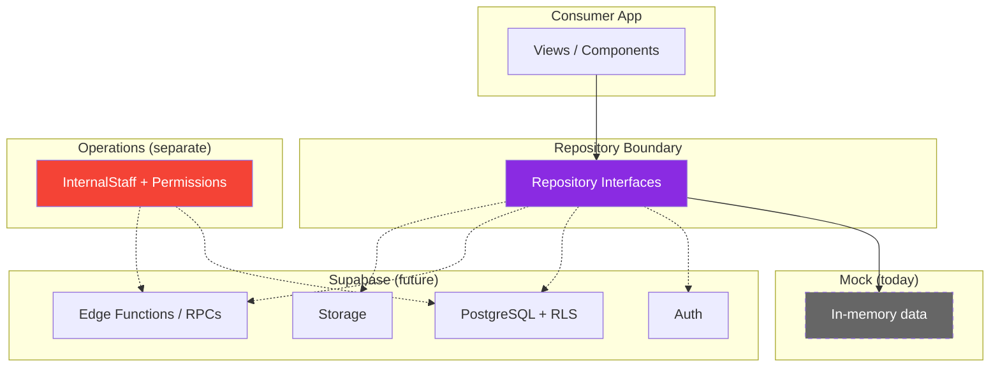
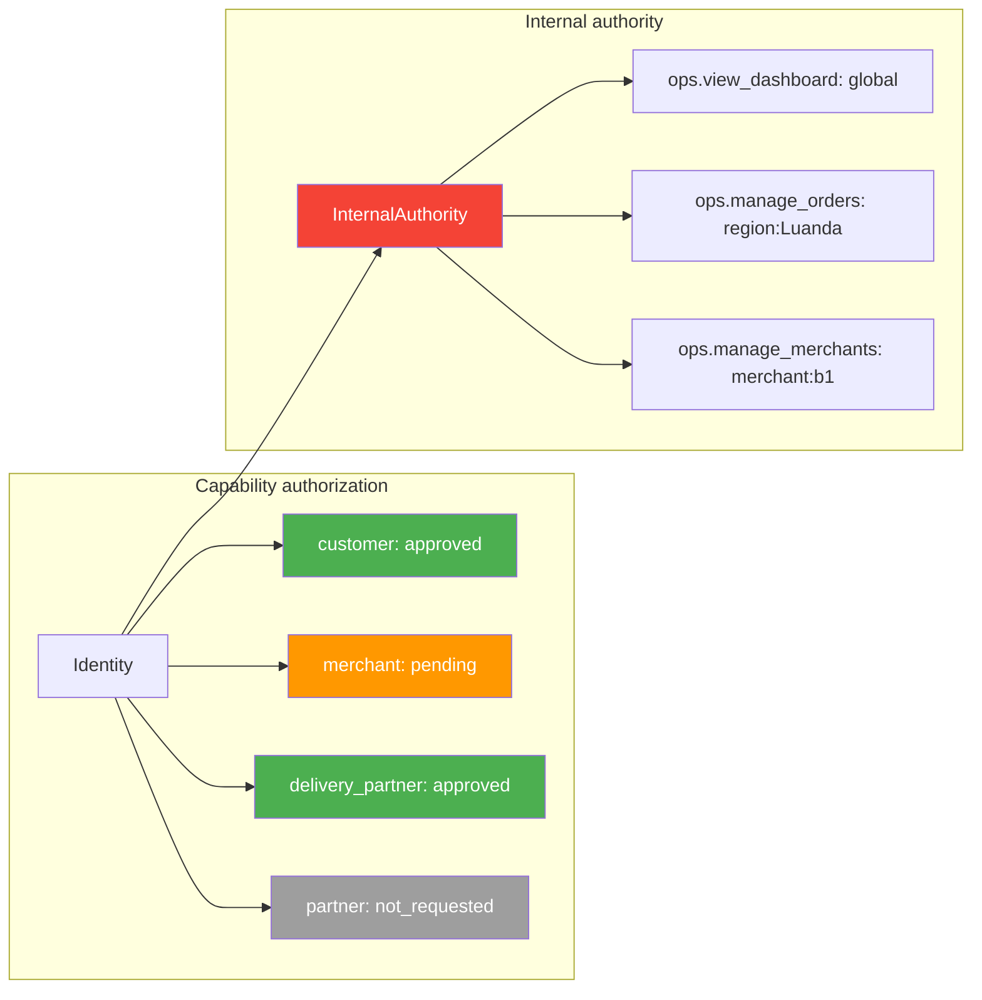
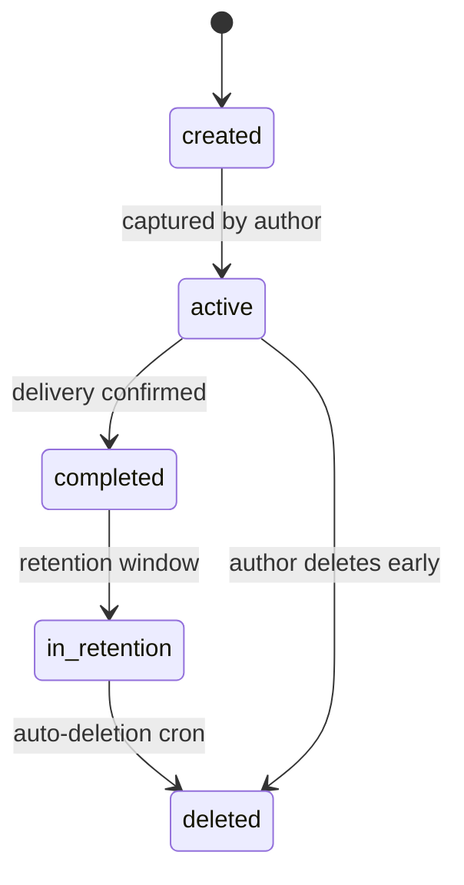

# PEDEJÁ — Security Architecture

Security is cross-cutting and present at every layer. This document describes the *intended*
security architecture. The consumer app today is a PWA over typed mocks; the server-side
controls below are designed in readiness for Supabase (Auth + PostgreSQL RLS + Storage +
Edge Functions) and are **not yet implemented**.

Date: 2026-09-10

---

## 1. Boundary model

| Layer | What holds authority | Notes |
| --- | --- | --- |
| Browser PWA | never trusted for truth | client prices/roles/status are inputs, not facts |
| Repository boundary | mediates access | UI → repository → (mock \| Supabase) |
| Supabase Auth | identity + sessions + OTP | phone/email later |
| PostgreSQL RLS | row-level authorization | restricts each sensitive table |
| Edge Functions / RPCs | state transitions & authorization | single authority for writes |
| Operations boundary | separate auth + InternalStaff permissions | `operacoes.pedeja.ao` |

---

## 2. Capability authorization

- Marketplace capabilities (customer, merchant, delivery_partner, partner) are **server-asserted**.
- Server is the only source of an `approved` capability. Role tampering via localStorage,
  React state, URL/query params, hidden UI or client-provided roles is ineffective because those
  inputs are never trusted for authorization.
- Operations authority comes only from `InternalStaff` + `Permission { scope }` evaluated
  server-side — never from consumer capability state.

---

## 3. Secrets handling

- **Never** expose `SUPABASE_SERVICE_ROLE_KEY` to the browser.
- **Never** put privileged secrets in `VITE_*` / `NEXT_PUBLIC_*`.
- Only anon-key Supabase env vars are permitted client-side (`VITE_SUPABASE_ANON_KEY`).
  Service-level operations run in Edge Functions (server env only).
- No credentials in the repo; `.env` is git-ignored; `.env.example` documents the vars.

---

## 4. Client/server trust rules

Never trust (client-supplied):

| Input | Why untrusted | Server enforcement |
| --- | --- | --- |
| `price` / totals | Manipulable | Server recomputes all totals |
| `role` / capability | Impersonable | Server derives from approved state |
| `order status` | Spoofable | Transitions server-only via RPCs |
| `delivery status` | Spoofable | Transitions server-only via RPCs |
| `merchant ownership` | Claimable | RLS joins on auth.uid / employee auth |
| `customer identity` | Claimable | RLS joins on auth.uid |
| `payment method/state` | Modifiable | Multicaixa reconciliation; cash confirmed at handover server-side |
| `rider earnings` | Inflatable | Server computes itemized payout lines |
| `internal permissions` | Escalatable | InternalStaff eval server-side, never from consumer state |

---

## 5. Sensitive resources & intended access (RLS intent)

See `DOMAIN_MODEL.md §21` for the table-by-table RLS intent. Highlights:

- `profiles`, `addresses` → owner.
- `orders`, `order_events` → own customer / authorized merchant staff / assigned partner /
  authorized internal staff.
- merchant data → authorized business staff (business scope) / authorized internal staff.
- `deliveries`, `delivery_assignments` → assigned partner / relevant merchant / authorized ops.
- `parcel_evidence` → restricted order participants / authorized support-ops under an explicit,
  logged policy.
- rider `location` → visible to assigned participants + ops while online only.
- `ratings` → participants of the rated context.
- `documents` → owner + authorized review staff.
- `internal_staff` / `permissions` → consumer app cannot read.

---

## 6. Storage & parcel evidence

- Private storage bucket(s) + strict authorization + short-lived signed URLs.
- Evidence lifecycle `created → active → completed → in_retention → deleted`; retention then
  automatic deletion by a server task; no permanent retention by default.
- Evidence is per-parcel, author-captured, and only readable by order participants or explicitly
  authorized Operations under a logged policy.

---

## 7. Threat model

| Threat | Defence (planned) |
| --- | --- |
| IDOR / BOLA (reading others' orders, addresses, payouts) | RLS joins on auth.uid; explicit participant table lookups; function-based queries |
| Privilege escalation | server-only capability approval; business-scoped merchant permissions; InternalStaff eval server-side |
| Role tampering | client capability/role never trusted; server derives truth |
| Session abuse / account takeover | Supabase sessions, short-lived + refresh tokens, device/session inventory in Profile (Sessões) |
| OTP brute force / phone abuse | rate limiting per phone/IP, attempt caps, exponential backoff, captcha where needed |
| Account enumeration | uniform OTP delivery responses, silent-fail semantics in UI, no distinct errors for existing accounts |
| Unauthorized Operations access | separate domain + auth + authorization; RLS gates all ops tables; staff needs employee identity |
| Unauthorized parcel evidence access | private bucket + signed URLs + participant-scoped policy + audit on access |
| Unauthorized rider location access | location only surfaced to assigned participants while online |
| Payment manipulation | server-side price/state authority; itemized totals; Multicaixa reconciliation path; refunds via REFUND_ISSUED events |
| Upload abuse | content checks, size limits, signed uploads to private bucket with owner metadata |
| Merchant sensitive action bypass | password challenge on frontend (mock: `1234`); production: server-side verification of identity before allowing changes |
| Rider accept timeout bypass | 15-second server-enforced timeout on DeliveryAssignment; expired offers pass to next partner |

---

## 8. Validation boundaries to test

- Customer: only own resources.
- Merchant: only own businesses' resources.
- Estafeta: only authorized assignments + own earnings.
- Partner: only authorized partner resources.
- Operations: only explicitly authorized employees, honoured scopes.
- External: storage-bypass attempts; signed-URL expiry; replay of OTP codes; direct table writes
  that skip RPC state machines.

---

## 9. Current state (honest)

- No live backend, no secrets, no real auth wired. Mock repositories are used; capability/
  evidence/ops features exist as documented design + typed domain only.
- Supabase client (`src/services/supabase.ts`) is stub-only — returns `null` when env vars
  are missing. No production auth, no database, no storage.
- Hardened error handling, input/output validation and audit logging are introduced with the
  Supabase phase — never with client-only enforcement.
